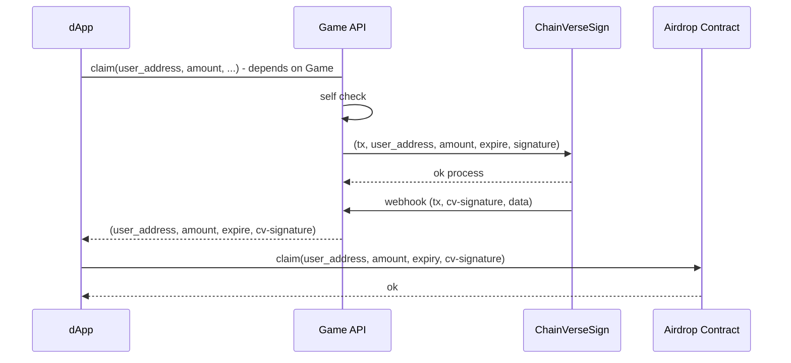

## Flow

## SIGN SERVICE API

### 1. API Sign Services

- Version: `1`
- Endpoint: `{cv-endpoint}/v1/sign-services`
- Method: `POST`
- Params:

| Name        | Require? |      Type |                                                                      Description |
|-------------|:-------------:|----------:|---------------------------------------------------------------------------------:|
| `tx`        | [x] |  `String` |                                       Partner transaction id/hash (unique in DB) |
| `data`      | [x] |  `Object` |                                                                Data of signature |
| `type`      | [x] |  `String` |                                                                Type of signature |
| `contract`  | [x] | `Address` |                                                Contract address verify signature |
| `signature` | [x] |  `String` | sign `Payload` with [EIP-712 format](#eip-712-format), types depend on game info |

- Response: `JSON Object`

| Name        |   Type   |              Description |
|-------------|:--------:|-------------------------:|
| `error_code` | `Number` | 0: success, others: fail |
| `messsage`  | `String` |         response message |

### 2. Webhook Signature

- Version: `1`
- Endpoint: `{game_endpoint}/signature-services`
- Method: `POST`
- Headers:

| Name          |      Require?      |  Type |                                      Description |
|---------------|:-------------:|------:|-------------------------------------------------:|
| `x-signature` | [x] | `String` | ethers.signMessage(`tx`) with server private key |

- Params:

| Name        | Require? |     Type |         Description |
|-------------|:-------------:|---------:|--------------------:|
| `tx`        | [x] | `String` |        `tx` of game |
| `data`      | [x] | `Object` | values of signature |
| `signature` | [x] | `String` |    signature for tx |


#### EIP-712 format

| Name               |                 Type                 |     Description |
|--------------------|:------------------------------------:|----------------:|
| `domain`           |               `Object`               |       CV define |
| `types`            |               `Object`               | Depends on Game |
| `value`            |               `Object`               |    Data to sign |

##### Types `CLAIM`

```json
{
  "Info": [
    {
      "name": "user",
      "type": "address"
    },
    {
      "name": "amount",
      "type": "uint256"
    },
    {
      "name": "expire",
      "type": "uint256"
    }
  ],
  "Payload": [
    {
      "name": "tx",
      "type": "string"
    },
    {
      "name": "type",
      "type": "string"
    },
    {
      "name": "contract",
      "type": "address"
    },
    {
      "name": "data",
      "type": "Info"
    }
  ]
}
```
